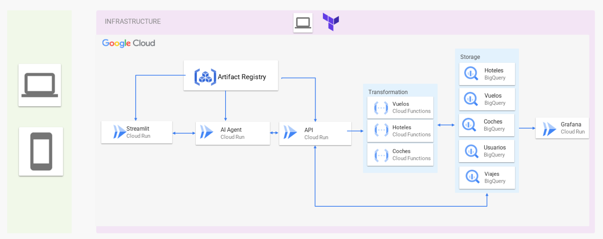

# DataProject_3 – Planificador de Vacaciones con IA

Proyecto que utiliza un sistema multiagente basado en IA para ayudar a los usuarios a planificar sus vacaciones mediante una interfaz conversacional. Desarrollado con FastAPI, Streamlit, LangGraph y desplegado completamente en Google Cloud Platform.

## 🧠 Descripción del Proyecto

La solución se compone de tres módulos principales:

1. **Frontend (Streamlit)**  
   Interfaz conversacional donde el usuario interactúa con el planificador de vacaciones.

2. **Agente de IA (FastAPI + LangGraph)**  
   Motor inteligente que coordina diferentes agentes para resolver peticiones del usuario (hoteles, vuelos, coches...).

3. **API de Datos (FastAPI)**  
   Fuente de datos que provee la información de hoteles, vuelos, usuarios, coches y viajes al sistema.

## 🚀 Despliegue Local

1. Clona el repositorio:
   ```bash
   git clone <repository-url>
   cd DataProject_3
   ```

2. Crea un archivo `.env` con tus variables:
   ```env
   GOOGLE_API_KEY=<GOOGLE_API_KEY>
   SERPAPI_KEY=<SERPAPI_KEY>
   RAPIDAPI_KEY=<RAPIDAPI_KEY>
   DATA_API_URL=<DATA_API_URL>
   AGENT_API_URL=<AGENT_API_URL>
   ```

3. Levanta todos los servicios:
   ```bash
   docker compose up -d --build
   ```

## ☁️ Arquitectura en GCP



Componentes desplegados:

- **Streamlit en Cloud Run** – interfaz frontend
- **Agente IA en Cloud Run** – backend conversacional
- **API de Datos en Cloud Run** – orquestación y acceso a la base de datos
- **Cloud Functions** – transformación de datos (vuelos, hoteles, coches)
- **BigQuery** – almacenamiento central de datos
- **Artifact Registry** – almacenamiento de imágenes Docker
- **Grafana en Cloud Run** – dashboards y monitorización en tiempo real

### Flujo de Datos

- El usuario interactúa con Streamlit.
- Las consultas se envían al Agente IA, que consulta la API de Datos.
- Las Cloud Functions procesan información específica y actualizan BigQuery.
- Grafana visualiza métricas clave desde BigQuery.

## 🛠️ Tecnologías Clave

- FastAPI  
- Streamlit  
- LangGraph  
- Docker + Docker Compose  
- Google Cloud (Cloud Run, Functions, BigQuery, Artifact Registry)  
- Grafana